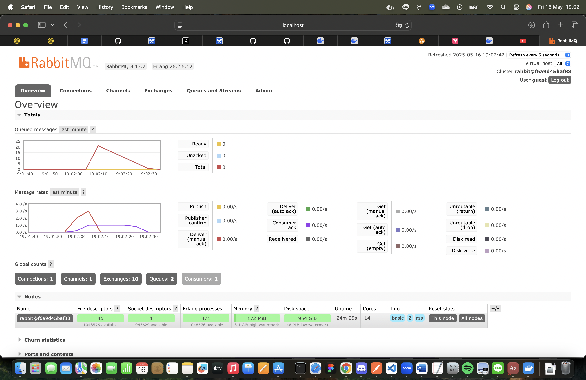

Nama : Arya Raditya Kusuma
NPM : 2306215816

## Understanding Questions

> a. What is amqp?

AMQP stands for Advanced Message Queuing Protocol. It is an open standard application layer protocol specifically designed for message-oriented middleware, enabling different applications or components of an application to communicate by sending and receiving messages. AMQP defines a set of rules for how messages are structured, routed, queued, and acknowledged, ensuring reliable and interoperable message exchange between disparate systems, regardless of the programming languages or platforms they use. This protocol facilitates asynchronous communication, meaning senders can publish messages without waiting for immediate processing by receivers, which helps in building decoupled and scalable systems. Message brokers like RabbitMQ are prominent examples of software that implement the AMQP specification to manage message queues and exchanges.

> b. What does it mean? guest:guest@localhost:5672 , what is the first guest, and what is the second guest, and what is localhost:5672 is for?

The string guest:guest@localhost:5672 is a connection URI (Uniform Resource Identifier) commonly used by applications to establish a connection with an AMQP message broker, such as RabbitMQ. Within this URI, the first guest signifies the username that the client will use to authenticate with the broker. The second guest, appearing after the colon and before the "@" symbol, represents the password associated with that username. Therefore, the client is attempting to log in as user "guest" with the password "guest". The portion localhost:5672 specifies the network address of the AMQP broker; localhost indicates that the broker is running on the same machine as the client application, and 5672 is the port number on that machine where the broker is listening for incoming AMQP connections, this being the standard default port for AMQP. In essence, this entire string instructs a client to connect to a locally running AMQP broker on port 5672 using the default "guest" credentials.

## Simulation slow subscriber

Explanation: When I look at the 'Queued messages' chart in my RabbitMQ management interface, the 'Total' number (often depicted by a red line) reflects the current count of messages waiting in the queue. I executed my cargo run command five times, and each of these runs is programmed to send five messages to the broker. This means, in total, I initiated the sending of 25 messages. The chart clearly shows this process: with each execution of my publisher, a batch of messages arrives, causing an upward step or an increase in the 'Total' queued messages.

However, I observed that the peak number of messages in the queue reached 20, not the full 25. The primary reason for this is that my subscriber program was running simultaneously and actively consuming messages from this same queue while I was still publishing. As I was adding new messages, my subscriber was, at the same time, pulling existing messages out for processing. Therefore, the peak of 20 represents the highest number of messages that were present in the queue at any single point in time before my subscriber could process enough of them to start reducing the count, or before I finished all my publishing runs. After all my publishing was complete, or even during the later stages of publishing, the chart shows the total number of queued messages decreasing as my subscriber continued to work through the remaining messages, eventually aiming to clear the queue.